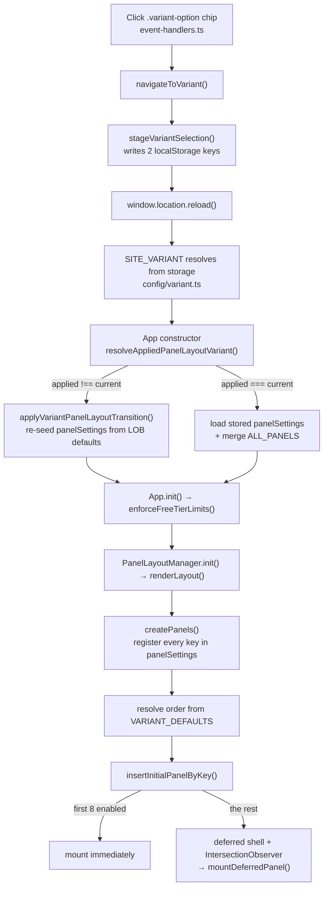

# Requirement

Integrate World Monitor into the MosAIc chatbot.

For people from different LOBs, display specific layers of data on the map

# Design

## workflow:
```
User Authenticates
        │
        ▼
Determine User LOB
        │
        ▼
Load LOB Entitlements
        │
 ┌──────┴───────┐
 ▼              ▼
Map Layers    Panels
 ▼              ▼
Render World Monitor Experience
```


## The 3 lists:

Our line of business:

Political violence

Cyber

Political risk

Transactional liability

Financial institutions

Professional liability

Environmental liability

Specialty casualty

Map layers:
[map layers](src/config/mosaic/_all-map-layers.csv)

Panels we have:
[panels](src/config/mosaic/_all-panels.csv)

## mapping strategy

Classify layers into:

Primary (enabled by default)

Secondary (available but off by default)

Not relevant (hidden by default)

[LOB → Layers](src/config/mosaic/lob2maplayers.csv)

[LOB -> Panels](src/config/mosaic/lob2panels.csv)

will be in the csv

## Additional features
### new customed page

### 

# implementation

Replace the different variants of the original code into the 8 LOBs we have; apply the mapping strategy. 

added an all page that display every panel and maplayers.

# demo

---

# Guide: from clicking a LOB to a rendered panel

This traces every function on the path from a click on the header LOB chip to a
panel element appearing in `#panelsGrid`. Line numbers are indicative — the
function names are the stable part.

The one structural idea to hold onto: **a LOB is registered as a variant id.**
Upstream World Monitor already had a six-variant system (`full`, `tech`,
`finance`, `commodity`, `energy`, `happy`) with panel seeding, layer gating,
and a switch-and-reset path. The nine lines are injected into those same
registries, so nothing on this path is LOB-specific machinery — it is the
variant machinery with nine more ids in it.

## The route at a glance



## Phase 0 — build time: CSV → TypeScript

Nothing at runtime reads the CSVs. `npm run generate:mosaic`
(`scripts/generate-mosaic-config.mjs`) reads
`src/config/mosaic/lob2panels.csv` and `lob2maplayers.csv` and writes
`src/config/mosaic/generated.ts`, which exports:

| Export | Shape | Meaning |
| --- | --- | --- |
| `LOB_IDS` | `readonly string[]` | the nine line ids, also used as variant ids |
| `LOB_PANELS` | `Record<LobId, {on, avail}>` | `on` = default-enabled, `avail` = offered but off |
| `LOB_LAYERS` | `Record<LobId, {on, avail}>` | same split for map layers |

`generated.ts` is a generated file — edit the CSVs and re-run, never edit it
directly. `src/config/mosaic/lobs.ts` wraps it with display metadata (`LOBS`:
label, shortLabel, icon) and the `isLobId()` / `getLobMeta()` helpers.

Current sizes (panels | layers):

| line | panels on | panels offered | layers on | layers offered |
| --- | ---: | ---: | ---: | ---: |
| political-violence | 23 | 52 | 10 | 31 |
| cyber | 10 | 25 | 6 | 13 |
| political-risk | 51 | 90 | 20 | 36 |
| transactional-liability | 22 | 87 | 9 | 26 |
| financial-institutions | 38 | 65 | 7 | 19 |
| professional-liability | 13 | 32 | 5 | 17 |
| environmental-liability | 18 | 34 | 13 | 24 |
| specialty-casualty | 11 | 32 | 6 | 29 |
| **all-lines** | **159** | **159** | **0** | **56** |

### The `all-lines` catalogue view

`all-lines` is the ninth chip and is deliberately **not** a column in either
CSV. `scripts/generate-mosaic-config.mjs` synthesizes it from every row in both
files (`ALL_LINES_ID`, `ALL_LINES_PANELS_ON`, `ALL_LINES_LAYERS_ON`), so it
stays complete for free — a hand-maintained column would need 215 `avail` cells
today and one more for every panel or layer added later.

The two halves are deliberately asymmetric, because panels and layers composite
differently:

- **Every panel is on.** `ALL_LINES_PANELS_ON = null` tells the generator
  "every key in the CSV," so `LOB_PANELS['all-lines'].avail` is empty. The
  panel grid is a vertical scroll, so "everything at once" just means a long
  page — that IS the point of this view.
- **Every layer is offered, none is on.** `LOB_LAYERS['all-lines'].on` is empty,
  so `DEFAULT_MAP_LAYERS` for this line is all-`false` and the map opens clean;
  `VARIANT_LAYER_ORDER['all-lines']` carries all 56 keys, so the picker offers
  55 of them (`iranAttacks` is stripped by `isSunsetLayer`) — more than any
  other variant, `full` included at 36. Layers composite onto one map, so
  "everything at once" is 56 overlapping overlays and an unreadable map, not a
  catalogue — they stay reachable but opt-in instead.

**The free-tier panel cap does not apply here.** `enforceFreePanelLimit()`
(`src/config/panels.ts`) normally clamps a free/anonymous session to
`FREE_MAX_PANELS` (40), stamping the overflow `proGated`. On every real line
that is correct — it is the same cap settings/search/tab-add all enforce. But
on `all-lines` it would hide 119 of 159 panels behind a paywall with no upsell
moment, since there is nothing to buy that makes "the catalogue view" bigger —
the page would just look broken. `FREE_PANEL_CAP` reads the module-level
`SITE_VARIANT` and resolves to `Infinity` when it is `'all-lines'`, `FREE_MAX_PANELS`
otherwise; every call site that gated on the count (`event-handlers.ts`,
`UnifiedSettings.ts`, `settings-window.ts`) reads `FREE_PANEL_CAP`, not the raw
constant, so the bypass is uniform across the toggle-one-at-a-time paths too.

It is not an underwriting line — it is the "show me everything this build has"
surface, for demos and for deciding what belongs in a real LOB.
`tests/mosaic-lob-registry.test.mts` locks the panel/layer shape, plus the rule
that anything offered by any other line must also be offered here.

## Phase 1 — module load: the LOB becomes a variant

This happens once per page load, at import time, before any user interaction.

**`src/config/panels.ts`**

1. `LOB_PANEL_CONFIGS` — for each LOB, walks `[...on, ...avail]` and looks each
   key up in `ALL_PANELS` (the union of all six public variants' panel
   definitions). The CSV decides *membership and default state*; the panel's
   actual definition — display name, priority, premium flag — still comes from
   `ALL_PANELS`. A CSV row naming a panel that no longer exists is skipped
   rather than fabricated. `on` is emitted first, which makes insertion order
   the LOB's canonical panel order.
2. `VARIANT_PANEL_CONFIGS` = `{...PUBLIC_VARIANT_PANEL_CONFIGS, ...LOB_PANEL_CONFIGS}`.
   From here on there is no distinction between a LOB and a public variant.
3. `VARIANT_DEFAULTS` = `Object.keys()` of each of those — **the canonical
   ordered key list per variant**. Read later by both the order resolver and
   the transition seeder.
4. `getEffectivePanelConfig(key, variant)` — the single accessor. Falls back to
   `ALL_PANELS[key]` for a key the variant doesn't own, then layers
   `VARIANT_PANEL_OVERRIDES` (per-variant renames like "Global Markets Map") on
   top.
5. `LOB_MAP_LAYERS` / `DEFAULT_MAP_LAYERS` / `MOBILE_DEFAULT_MAP_LAYERS` — every
   `MapLayers` key set false, then the LOB's `on` set switched true. LOBs use
   the same set on mobile (the CSV is already curated, unlike the broad public
   variants which need trimming).

**`src/config/map-layer-definitions.ts`**

`LOB_LAYER_ORDER` is spread into `VARIANT_LAYER_ORDER`, which is what
`getLayersForVariant()`, `getAllowedLayerKeys()`, and
`sanitizeLayersForVariant()` gate against. An unknown id falls back to `full`.

**`src/config/variant.ts`** — resolves `SITE_VARIANT` for the session (Phase 3).

> `SITE_VARIANT`, `DEFAULT_PANELS`, `SITE_VARIANT_DEFAULTS`, and
> `DEFAULT_MAP_LAYERS` are all module-level constants. The active LOB is frozen
> at import time, which is why switching requires a full page reload rather
> than an in-place re-render.

## Phase 2 — the click

**Rendering the chips** — `PanelLayoutManager.renderLayout()`
(`src/app/panel-layout.ts`) maps over `LOBS` and emits one
`<a class="variant-option" data-variant="{lob.id}" href="#">` per LOB inside
`.variant-switcher.lob-switcher`. `href` is always `#`: LOBs have no subdomain
of their own, so every switch is handled in-page.

**The listener** — `EventHandlerManager.setupEventListeners()`
(`src/app/event-handlers.ts:704`) binds a click handler to every
`.variant-option`, short-circuits if the chip is the current variant, and calls:

```
navigateToVariant(variant, { href, isLocalDev })      // event-handlers.ts:1533
  ├─ trackVariantSwitch(SITE_VARIANT, variant)        // analytics
  ├─ exitFullscreenForNavigation()
  ├─ isLobId(variant) → true                          // config/mosaic/lobs.ts
  ├─ stageVariantSelection(SITE_VARIANT, variant, writeStorageValue)
  └─ window.location.reload()
```

The `isLobId()` guard matters: without it the deployed (non-local) path would
look up `VARIANT_META[lob]` for a subdomain URL, find nothing, and return
silently — a dead switcher in production.

**`stageVariantSelection()`** (`src/services/variant-panel-ownership.ts`) writes
exactly two keys, in this order:

| key | value | why |
| --- | --- | --- |
| `worldmonitor-panel-layout-variant` | the **old** variant | "the layout currently on disk belongs to this variant" |
| `worldmonitor-variant` | the **new** variant | "this is what the user selected" |

The deliberate disagreement between the two keys is the signal the next boot
reads to know a switch happened. If the first write fails, the second is
skipped and no reload occurs — a half-staged switch is worse than none.

## Phase 3 — reload: resolving the active LOB

`src/config/variant.ts`, the `SITE_VARIANT` IIFE. A stored selection wins over
everything else, checked via `isSelectableVariant()` (public variants **plus**
the eight LOB ids). This ordering is load-bearing: the hostname checks below it
would otherwise pin every LOB user to `full`, since no LOB has a subdomain.
With no stored value at all, `buildVariant` falls back to `political-violence`
rather than upstream's `full`.

## Phase 4 — App constructor: resolving `panelSettings`

`src/main.ts` calls `new App('app')`. The constructor resolves map layers and
panel settings **before** any DOM work.

```
resolveAppliedPanelLayoutVariant({ appliedVariant, legacyVariant, currentVariant, ... })
```

Returns the variant whose layout is actually on disk. Then one of three
branches:

**(a) storage blocked** → `getInitialPanelSettingsForVariant(currentVariant)`,
a pure first-visit seed, no persistence.

**(b) `applied !== current`** — a switch happened. This is the LOB-switch path:

- `localStorage.removeItem(STORAGE_KEYS.mapLayers)` — layers reset hard to the
  new LOB's defaults, then `sanitizeLayersForVariant()` +
  `normalizeExclusiveChoropleths()`.
- `applyVariantPanelLayoutTransition({ variantPanelKeys: VARIANT_DEFAULTS[lob], getDefaultPanel: key => getEffectivePanelConfig(key, lob), ... })`:
  1. every key **outside** the new LOB's set is disabled via
     `userSetPanelEnabled(config, false)` (which also clears the `proGated`
     marker, so the free-tier gate no longer claims ownership of the disable);
  2. every key **inside** the new LOB's set is re-seeded from
     `getDefaultPanel(key)` — name, priority, premium, and `enabled` all come
     from the new LOB. A user's `fontScale` is carried through, since that is a
     display preference with no variant opinion.
  3. `persistPanels()` then `persistAppliedVariant()` — in that order, so a
     crash between them retries the reset next boot instead of recording an
     unapplied layout as current.

**(c) `applied === current`** — an ordinary reload. Loads stored settings, runs
the one-time key-rename / prune / layout-reset migrations, and merges in any
`ALL_PANELS` key added since the blob was written (`enabled` only if it is in
this variant's defaults). This merge is why every panel stays addressable from
Cmd+K and the settings modal on every LOB.

> **The bug that lived here.** Step 2 above used to read
> `if (!(key in next)) next[key] = ...` — seed only what's *missing*. But
> branch (c) merges all of `ALL_PANELS` into the blob, so by the second boot
> nothing is ever missing and the new LOB's defaults were applied to nothing.
> What survived a switch was the *intersection* of the old and new LOB's
> enabled sets, shrinking monotonically toward empty over consecutive switches.
> The public variants had the same defect but hid it: each lives on its own
> subdomain, hence its own `localStorage` origin. LOBs share one origin and
> switch in place, which made it reachable in a few clicks.
> Locked by `tests/variant-panel-ownership.test.mts`.

## Phase 5 — `App.init()`

- `enforceFreeTierLimits()` — clamps to `FREE_MAX_PANELS` (40) via the shared
  `enforceFreePanelLimit()`, skipping itself while the tier is still
  unresolved. Panels it disables are stamped `proGated: true` so upgrading
  restores exactly those and not ones the user hid deliberately. Note
  `political-risk` ships 51 default-on panels, so free-tier users see it
  clamped.
- `await this.panelLayout.init()` — Phase 6.

## Phase 6 — `PanelLayoutManager`: registration, order, mount

`init()` → `renderLayout()`:

1. `setTrustedHtml()` installs the whole app shell in one write — header (with
   the LOB chips), map section, and the empty `<div class="panels-grid"
   id="panelsGrid">`.
2. `await this.createPanels()`.
3. `initPanelTabs()` — wraps the current layout in a dashboard tab.

**`createPanels()`** is ~700 lines of registration calls, one per panel:
`lazyDefaultPanel()`, `lazyImportedPanel()`, `createNewsPanel()`. All funnel
into `lazyPanel(key, loader)`, which is the gate:

```
lazyPanel(key, ...)
  ├─ shouldCreatePanel(key) → hasPanelSettingEntry(ctx.panelSettings, key)
  │     └─ false → return false, panel never exists this session
  ├─ already in ctx.panels or lazyPanelRegistrations → return false (dedup)
  └─ store a { load } thunk in lazyPanelRegistrations — nothing imported yet
```

Note the gate is **presence in `panelSettings`, not `enabled`** — a panel the
LOB offers but defaults off is still registered, so the user can toggle it on
without a reload. A key absent from `panelSettings` entirely is unreachable.

**Order resolution** (still inside `createPanels()`):

```
variantOrder  = VARIANT_DEFAULTS[SITE_VARIANT] minus 'map'   ← the LOB's canonical order
crossVariant  = keys in panelSettings not in variantOrder     ← cross-enabled extras
defaultOrder  = [...variantOrder present in settings, ...crossVariant]
savedOrder    = getSavedPanelOrder()                          ← the user's drag order
```

If a saved order exists it wins, with missing keys spliced in at their
`defaultOrder` neighbours; otherwise `defaultOrder` is used with `live-news`
and `live-webcams` forced to the top. Result lands in `resolvedPanelOrder` and
is split into sidebar vs. `mapBottomGrid` on ultra-wide screens.

> Panel order is **not** cleared on a variant switch, so shared panels keep the
> arrangement you dragged them into under the previous LOB.

**Mounting** — `insertInitialPanelByKey(grid, key)` per key, in order:

```
insertInitialPanelByKey(grid, key)
  ├─ panel already constructed → insertInitialPanel()
  └─ lazy registration exists  → deferPanelMount(key, null, grid, enabled)
        ├─ createDeferredPanelShell()   ← skeleton reserving the exact grid slot
        │     footprint from DEFERRED_PANEL_NATURAL_FOOTPRINTS (rowSpan / panel-wide)
        ├─ insertByOrder(grid, placeholder, key)
        └─ observeDeferredPanelShell()  ← IntersectionObserver, rootMargin 900px
                                          desktop / 700px mobile
  └─ shouldMountPanelImmediately(key) → mountDeferredPanel(key) right now
```

`shouldMountPanelImmediately()` returns true only while
`initiallyMountedEnabledPanelCount` is under the budget —
`INITIAL_PANEL_MOUNT_BUDGET_DESKTOP = 8`, `..._MOBILE = 3`. So on a LOB with 23
default-on panels, 8 mount during boot and 15 get a skeleton that hydrates on
scroll approach.

`mountDeferredPanel(key)` → `loadRegisteredPanel(key)` runs the stored thunk
(the dynamic `import()` finally fires) → `mountPanelElement()` replaces the
placeholder in place, applies font scale, wires drag handlers, and calls
`panel.notifyConnected()`. Failures retry up to 3× at 1s, then leave the
skeleton and re-arm on the `online` event.

**Later toggles** — `applyPanelSettings()` is the re-render entry point for
everything after boot (settings checkbox, tab switch, free-tier clamp,
mission preset). It walks `ctx.panelSettings` and, per key, mounts a deferred
panel that just became enabled, toggles placeholder visibility, or calls
`panel.toggle(enabled)`. `map` is special-cased to a class on `#mapSection`.

## Invariants worth not breaking

- **A key must be in `panelSettings` to exist.** `lazyPanel()` bails on
  anything else, permanently for that session.
- **`VARIANT_DEFAULTS[lob]` is both membership and order.** It is
  `Object.keys()` of the config map, and `LOB_PANEL_CONFIGS` inserts `on`
  before `avail` — reorder that loop and you reorder the dashboard.
- **A variant switch resets panel state, not panel order.** Layers reset hard;
  panels re-seed to LOB defaults; drag order and spans persist.
- **`proGated` distinguishes "the gate hid this" from "the user hid this."**
  Any code that turns a panel off on the user's behalf must go through
  `userSetPanelEnabled()`.
- **Panel definitions live in `ALL_PANELS`, membership lives in the CSV.** To
  add a panel to a LOB, edit the CSV and re-run `npm run generate:mosaic`. To
  change what a panel *is*, edit `panels.ts`.
- **Adding a line means touching three lists.** `LOB_IDS` (generated), `LOBS`
  in `mosaic/lobs.ts` (the header chip), and the inlined `LOB_VARIANTS` in
  `config/variant.ts` — the last is deliberately not imported from the
  generated file, so only `tests/mosaic-lob-registry.test.mts` connects them. A
  line missing from `LOBS` has no chip; one missing from `LOB_VARIANTS` cannot
  be persisted, so its chip reloads straight back to the previous line.

## Known gap: the SVG / mobile fallback map

`src/components/Map.ts` — the non-WebGL fallback renderer — picks its layer
list from a hardcoded `SITE_VARIANT === 'tech' | 'finance' | 'happy' | 'energy'`
chain with `fullLayers` as the fallback. It predates the LOB work and has no
line-of-business branch, so **every line (all nine) gets `full`'s ~20 SVG layers
there** rather than its own set. The DeckGL path is unaffected — it reads
`getLayersForVariant()` and is correct per line. Fixing it means intersecting
each line's layer order with the SVG-renderable subset that file actually draws,
which is why the lists were hardcoded in the first place.

## Debugging checklist

| Symptom | Look at |
| --- | --- |
| No panels at all after switching | `applyVariantPanelLayoutTransition()` — is the new LOB's `on` set actually being seeded? |
| One panel missing everywhere | Is its key in `_all-panels.csv` **and** in `ALL_PANELS`? `LOB_PANEL_CONFIGS` silently skips unknown keys. |
| Panel in Cmd+K but not on the grid | `enabled: false` in `panelSettings`, or `proGated` from the free-tier cap (`FREE_PANEL_CAP` — 40 on real lines, uncapped on `all-lines`). |
| Panels appear then vanish | Free-tier clamp landing after boot — `enforceFreeTierLimits()`. |
| Switcher does nothing in production | `isLobId()` guard in `navigateToVariant()`. |
| Layers wrong but panels right | `VARIANT_LAYER_ORDER` / `sanitizeLayersForVariant()`, not the panel path. |

Inspect live state from the console:

```js
localStorage.getItem('worldmonitor-variant')                // selected LOB
localStorage.getItem('worldmonitor-panel-layout-variant')   // LOB the stored layout belongs to
Object.entries(JSON.parse(localStorage.getItem('worldmonitor-panels')))
  .filter(([, v]) => v.enabled).map(([k]) => k)             // what should render
```
